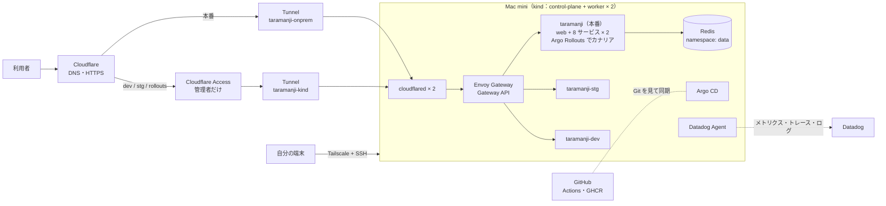
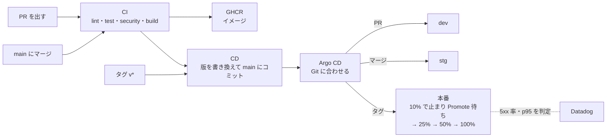
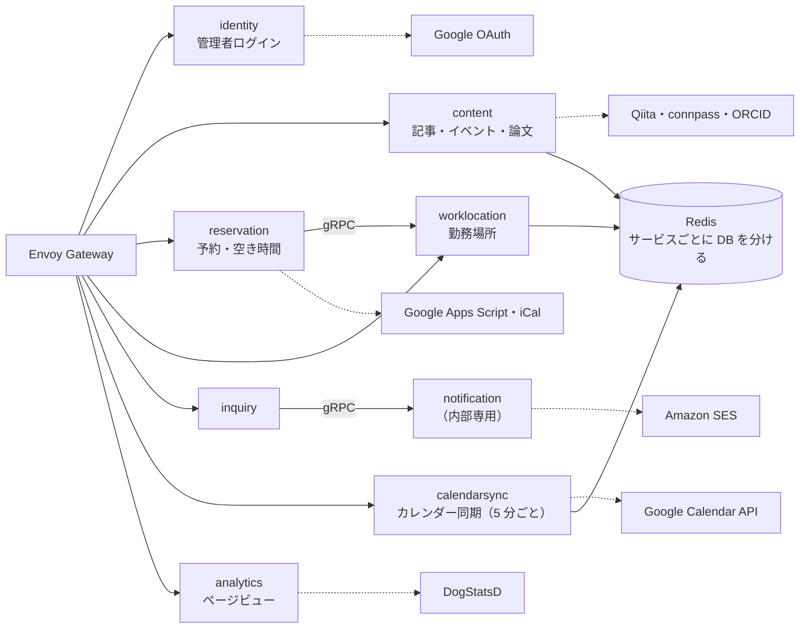
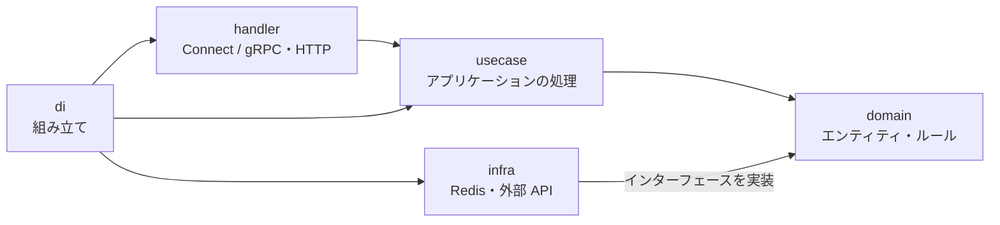
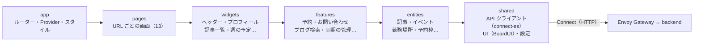

<!-- 1. GitHub usernameを変更 -->

  

<!-- 2. プロフィールや連絡先を変更 -->
##  Hi there

- 🧑‍💻 I'm a backend engineer.
- 📫 How to reach me: [taramanji.com](https://taramanji.com)
 

<!-- 3. 好きな技術スタックに変更 -->
<!-- ライトモート：theme=light, ダークモート：theme=dark -->
<!-- アイコンの選択肢一覧：https://arc.net/l/quote/zizyykfh -->
## 🌱 Skills

 

<!-- 4. GitHub usernameを変更, 2箇所 -->
<!-- ライトモート：theme=light, ダークモート：theme=vue-dark  -->
## 🏃‍♀️ Activities

  
  

 

---

## 🏠 taramanji.com の構成

ポートフォリオサイト [taramanji.com](https://taramanji.com) は、自宅の Mac mini（M4）1 台の中の Kubernetes（kind）で動いています。

### インフラ

- ルーターのポートは開けていない（cloudflared・Argo CD・Datadog Agent はすべて家の中から外へ接続）
- 秘密は Sealed Secrets で暗号化して Git に置く。Pod 同士の通信は NetworkPolicy で必要な分だけ許可

### リリースの流れ（CI / CD）

### バックエンド（`backend/`：Go・Connect / gRPC）

各サービスは同じ層の形（DDD + クリーンアーキテクチャ）で、`proto/` から型とハンドラーを生成しています。

### フロントエンド（`frontend/`：React + Vite + TypeScript・FSD）

- 上の層は下の層だけを使う（Feature-Sliced Design。`npm run lint:fsd` で確認）
- ビルドした静的ファイルを nginx のコンテナで配る。リリースで JS のファイル名が変わっても、古いタブは 1 回だけ読み直して新しい版に切り替わる
