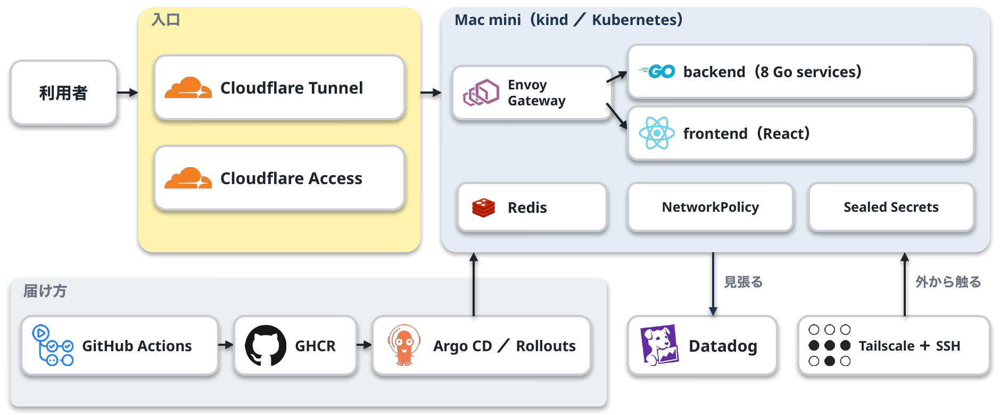
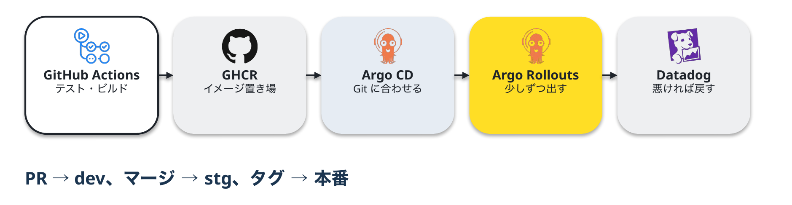
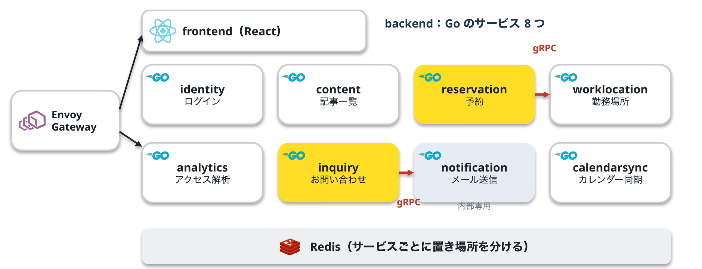
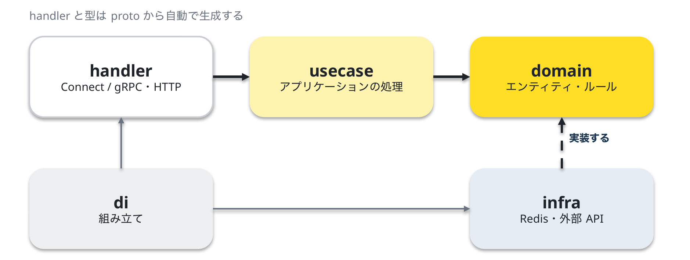
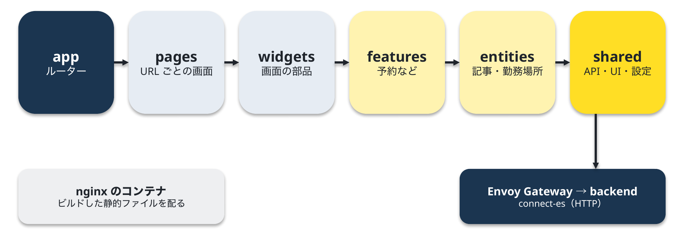

<!-- 1. GitHub usernameを変更 -->

  

<!-- 2. プロフィールや連絡先を変更 -->
##  Hi there

- 🧑‍💻 I'm a backend engineer.
- 📫 How to reach me: [taramanji.com](https://taramanji.com)
 

<!-- 3. 好きな技術スタックに変更 -->
<!-- ライトモート：theme=light, ダークモート：theme=dark -->
<!-- アイコンの選択肢一覧：https://arc.net/l/quote/zizyykfh -->
## 🌱 Skills

 

<!-- 4. GitHub usernameを変更, 2箇所 -->
<!-- ライトモート：theme=light, ダークモート：theme=vue-dark  -->
## 🏃‍♀️ Activities

  
  

 

---

## 🏠 taramanji.com の構成

ポートフォリオサイト [taramanji.com](https://taramanji.com) は、自宅の Mac mini（M4）1 台の中の Kubernetes（kind）で動いています。

### インフラ・使っている技術

- 利用者のアクセスは Cloudflare Tunnel を通って家に届く。ルーターのポートは 1 つも開けていない
- dev・stg・Argo Rollouts の画面は Cloudflare Access で管理者だけに制限。外からの作業は Tailscale ＋ SSH

### リリースの流れ（CI / CD）

- PR → dev、main にマージ → stg、タグ（`v*`）→ 本番
- 本番はカナリア：10% で止まって Promote を待ち、25% → 50% → 100%。Datadog で 5xx 率と p95 を見て、悪ければ自動で元に戻す

### バックエンド（`backend/`：Go・Connect / gRPC）

各サービスは同じ層の形（DDD ＋ クリーンアーキテクチャ）です。

### フロントエンド（`frontend/`：React ＋ Vite ＋ TypeScript）

