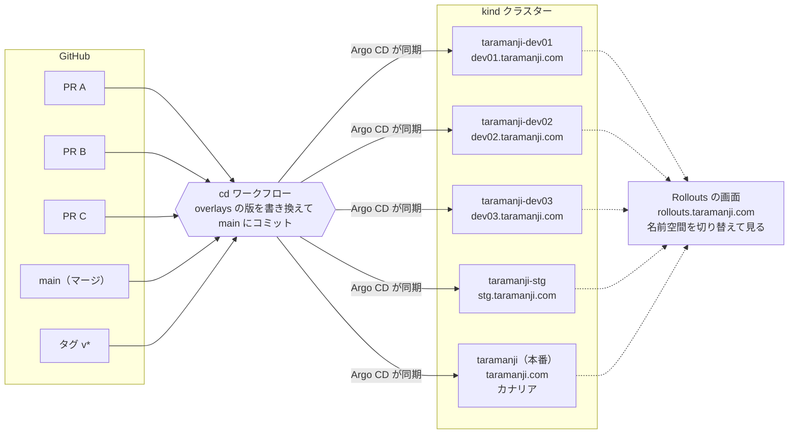
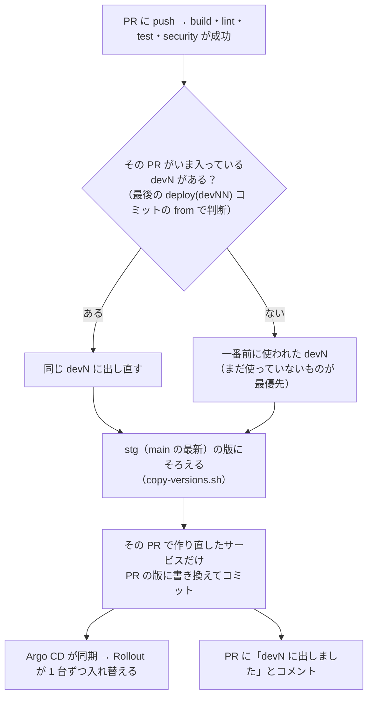

# taramanji.com on kind（GKE に寄せた構成）

```
利用者 ─ Cloudflare（DNS・TLS）─ Tunnel ─▶ cloudflared（ns: cloudflared, 2 Pod）
                                              │ http://taramanji-gateway.envoy-gateway-system
                                              ▼
                       Envoy Gateway（Gateway API。Service type=LoadBalancer）
     HTTPRoute site: taramanji.com / www         ─┬─ /taramanji.<svc>.v1.*  → 各 Go サービス（Connect）
                                                   ├─ /api/auth/*            → identity
                                                   ├─ /api/metrics/pageview  → analytics
                                                   └─ /                      → web（nginx + React）
     HTTPRoute gws: gws.taramanji.com             ─── /admin・ログイン・カレンダー同期だけ。他は taramanji.com へ 308
ns: taramanji  Go サービス 8 つ（各 2 Pod・PDB・ゾーン分散）+ web + CronJob（5 分ごとの同期）
               inquiry ─gRPC→ notification（内部専用） / reservation ─gRPC→ worklocation
ns: data       Redis StatefulSet（AOF・PVC standard-rwo・サービスごとの ACL と DB 番号）
ns: datadog    Datadog Agent（APM・DogStatsD・ログ・イベント・Envoy/Redis/nginx/cloudflared/Argo CD/Argo Rollouts・HTTP Check）
```

## 構成

| ディレクトリ | 中身 |
| --- | --- |
| `../kind/` | クラスター（コントロールプレーン 1 + ワーカー 2）、ローカルレジストリ、Envoy Gateway・metrics-server |
| `../gitops/` | Argo CD・Argo Rollouts・Sealed Secrets の導入（bootstrap.sh）と Argo CD のアプリ定義 |
| `base/apps` `base/data` `base/routes` `base/gateway` | 環境に依存しないマニフェスト（namespace とホスト名はオーバーレイで決める） |
| `overlays/prod/` | 本番（namespace: taramanji / data）。Argo Rollouts のカナリアと Datadog の自動判定、cloudflared |
| `overlays/dev01〜03/` | dev（namespace: taramanji-dev01〜03）。PR ごとに空いているものを使う。dev01.taramanji.com など |
| `overlays/stg/` | stg（namespace: taramanji-stg）。main の最新 |
| `components/nonprod/` | dev01〜03・stg の共通部分。1 台ずつ・HPA/PDB なし・Rollout（カナリアなし。Rollouts の画面で見るため）・CronJob 停止 |
| `overlays/gke/` | GKE に載せるときの差分（未適用） |
| `scripts/` | `make-secrets.sh`（平文を secrets/ に作る）・`seal.sh`（暗号化して sealed/ に）・`set-version.sh`（版の書き換え）・`changed-services.py`（作り直すサービスの判定） |
| `observability/` | Datadog Agent の設定、ダッシュボード、モニター |

## リリースの流れ（GitOps）

ワークフロー（`.github/workflows/`）: CI は `lint` `test` `security` `build`、反映（CD）は `cd` だけ。

| 環境 | 反映のきっかけ | URL |
| --- | --- | --- |
| dev01〜03 | main への PR（同じリポジトリのブランチ）／手動実行 | dev01.taramanji.com・dev01-gws.taramanji.com（02・03 も同じ形） |
| stg | main への push（マージ）／手動実行 | stg.taramanji.com・stg-gws.taramanji.com |
| prod | タグ `v*` の push | taramanji.com・gws.taramanji.com |

```
PR を出す・更新する ──▶ CI: lint（書式・静的解析・生成コード・マニフェスト）/ test（単体テスト）/ security（gitleaks）
                          / build（イメージを GHCR に push。sha-xxxxxxx、arm64 + amd64）
                     ──▶ CD: build の成功で動き、同じコミットの lint・test・security の成功も確かめてから
                          dev01〜03 から出す先を選び（その PR がいま入っている devN、なければ一番前に使われた devN）、
                          stg の版にそろえてから作り直したサービスだけ書き換えて main にコミット ──▶ Argo CD がその devN に同期
                          （PR に「devN に出しました」とコメントが付く）
main にマージ        ──▶ 同じく CI ──▶ CD が overlays/stg を書き換え ──▶ Argo CD が stg に同期
stg で確認して git tag v1.2.3 <そのコミット> && git push origin v1.2.3
                     ──▶ CD（deploy-prod）: イメージに v1.2.3 を付け、overlays/prod の版を書き換えてコミット、GitHub Release を作る
                     ──▶ Argo CD が prod に同期 ──▶ Argo Rollouts がカナリア
                         10%（ここで止まる。promote で先へ）→ 25%（5 分）→ 50%（5 分）→ 100%（web は混ぜずに一度に切り替え）
                         その間ずっと Datadog で新しい版の 5xx 率（< 5%）と p95（< 3 秒、RunSync は除く）を判定し、2 回外れたら自動で元の版に戻す
手動実行             ──▶ GitHub の Actions → cd → Run workflow で、ブランチと dev / stg を選ぶ（その場で lint・test・security・build してから反映）
```

**変わったサービスだけ作り直して入れ替える。**

- build：変わったファイルから、作り直すサービスを決める（`scripts/changed-services.py`）
  - `backend/internal/<サービス>/`・`backend/cmd/<サービス>/` → そのサービス
  - Go の共通部分（`backend/pkg/`・生成コード `backend/gen/` など）→ Go の依存関係（`go list -deps`）で、使っている全サービス
  - `go.mod`・Dockerfile・`proto/` など判断できないもの → Go の 8 つ全部。`frontend/` → web
  - ドキュメント・テスト・マニフェストだけの変更 → 作り直さない
  - 判定のテスト：`scripts/changed-services_test.sh`（CI の test で実行）
- cd（dev / stg）：そのコミットのイメージがあるサービス（＝作り直したサービス）だけ版を書き換える
- 本番：前のタグから変わったサービスだけに、新しい版のタグを付けて書き換える（`scripts/release-images.sh`）。変わっていないサービスは入れ替わらない
- 各サービスの版（Datadog の version）は、overlay の `replacements` でそのサービスのイメージのタグから取る

```bash
# カナリアの様子
kubectl argo rollouts --context kind-taramanji -n taramanji get rollout reservation --watch
# 10% で待っているものを先へ進める（25% → 50% → 100% は自動）。画面なら https://rollouts.taramanji.com
kubectl argo rollouts --context kind-taramanji -n taramanji promote reservation
# 途中で止める・すぐ全部に出す・中止して戻す
kubectl argo rollouts --context kind-taramanji -n taramanji pause reservation
kubectl argo rollouts --context kind-taramanji -n taramanji promote reservation --full
kubectl argo rollouts --context kind-taramanji -n taramanji abort reservation
# 前の版に戻す（Git が正）: 版を書き換えたコミットを revert するか、前のタグでもう一度リリースする
deploy/k8s/scripts/set-version.sh prod v1.2.2 reservation && git commit -am "deploy(prod): rollback reservation to v1.2.2" && git push   # サービスを省くと全部

# Argo Rollouts の画面: https://rollouts.taramanji.com（Cloudflare Access で管理者だけ）。Promote / Abort をボタンで

# Argo CD の画面
kubectl --context kind-taramanji -n argocd port-forward svc/argocd-server 8080:80   # http://localhost:8080
```

## Secret

Git（public）には暗号化した SealedSecret だけを置く。平文は `secrets/<env>/`（git に入らない）。

```bash
deploy/k8s/scripts/make-secrets.sh dev     # 平文を作る / 作り直す（パスワードは前回の値を使い回す）
for e in dev01 dev02 dev03; do deploy/k8s/scripts/seal.sh $e; done   # secrets/dev/ を各 devN の namespace 向けに暗号化 → コミット
```

Secret を変えたら Pod を作り直す（`kubectl rollout restart` / Rollout は `kubectl argo rollouts restart`）。

## dev 環境（dev01〜03）

### 全体の流れ



### PR をどの devN に出すか（`scripts/pick-dev.sh`）



### 例: PR が 4 つあるとき

| 順番 | できごと | dev01 | dev02 | dev03 |
| --- | --- | --- | --- | --- |
| 1 | PR A を push | **A** | （空き） | （空き） |
| 2 | PR B を push | A | **B** | （空き） |
| 3 | PR C を push | A | B | **C** |
| 4 | PR A に追加の push | **A**（同じ場所に出し直し） | B | C |
| 5 | PR D を push（空きなし） | A | **D**（一番前に使われた B を上書き） | C |
| 6 | PR B に追加の push | A | D | **B**（一番前に使われた C を上書き） |

- https://dev01.taramanji.com と https://dev01-gws.taramanji.com（02・03 も同じ。staging トンネル経由）。Cloudflare Access で本人だけに制限する
- PR が 3 つより多いときは、一番前に使われた devN を次の PR が使う（前の PR は、次に push したときに別の devN へ出し直される）
- どの devN に何が出ているか: main の `git log --grep '^deploy(dev0'`、PR のコメント、Argo CD の画面（taramanji-dev01〜03）
- 入れ替わりの様子は Rollouts の画面（rollouts.taramanji.com）で、名前空間を taramanji-devNN / taramanji-stg に切り替えて見る
- データは devN ごとの Redis（同じ namespace）。カレンダー同期の CronJob は止めてある（実在のカレンダーを書き換えないため）
- 予約・お問い合わせは本物の GAS・SES に届くので、試すときは自分宛てに

## よく使う操作

```bash
kubectl --context kind-taramanji -n taramanji get pods -o wide
kubectl --context kind-taramanji get gateway,httproute -A
kubectl --context kind-taramanji -n taramanji get hpa,pdb,rollout
kubectl --context kind-taramanji -n taramanji logs deploy/reservation --tail=50   # JSON。trace_id で Datadog のトレースへ

# ワーカーを 1 台止めてもサイトが止まらないことの確認
kubectl --context kind-taramanji drain taramanji-worker --ignore-daemonsets --delete-emptydir-data
kubectl --context kind-taramanji uncordon taramanji-worker

python3 deploy/k8s/observability/dashboard.py
python3 deploy/k8s/observability/monitors.py
```

## モニターが鳴ったら

| モニター | まず見るところ |
| --- | --- |
| Gateway の 5xx 率 | ダッシュボードの「ステータスクラス別」→ 上流（envoy_cluster_name）→ APM のエラーのトレース |
| p95 レイテンシ | 「遅い RPC」→ トレースの外部呼び出し（GAS・Qiita・Google） |
| 再起動を繰り返す / Ready が足りない | `kubectl describe pod`（OOMKilled・probe 失敗）、`kubectl logs --previous` |
| トンネルの接続が減った | `kubectl -n cloudflared logs deploy/cloudflared`、Mac mini のネットワーク |
| Redis のメモリ | `redis-cli --user admin INFO memory`、キャッシュ（`content:*`）の量 |
| カレンダー同期の失敗・停止・要再接続 | gws.taramanji.com/admin の前回の結果、CronJob `calendarsync-run` の Job のログ |
| 予約の作成失敗 | `reservation.created{status:failed}` の reason タグ、GAS のデプロイ |
| メール送信の失敗 | notification のログ、SES の送信制限・認証情報 |

## データ

- Redis: `kubectl --context kind-taramanji -n data exec -it redis-0 -- redis-cli --user admin --pass <deploy/k8s/secrets/prod/generated.env の REDIS_PASSWORD_ADMIN>`
- DB 番号: 0 = worklocation、1 = content（キャッシュ）、2 = calendarsync
- PV は Mac の `~/taramanji-data/worker*` にあり、クラスターを作り直しても残る（StorageClass は Retain）
